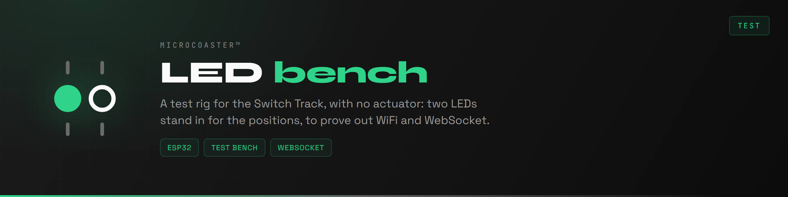
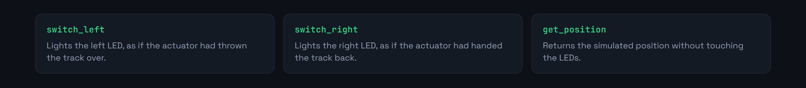

<div align="center">

<p>
  <a href="README.md"></a>
  
</p>



</div>

A test bench for the Switch Track module, with no mechanical parts. Two LEDs stand in for the actuator: one lights up for the left position, the other for the right. Everything else is identical to the real module, captive portal, authentication and WebSocket link included.

It is there to prove out the whole chain between the server and a module before an actuator is ever wired in. If the LEDs change at the right moment, the problem is not in the network.


Debugging a WebSocket link with an actuator attached means stacking two sources of failure. An order that never arrives and an actuator that will not move produce exactly the same symptom.

This repository isolates the software half. You check that authentication goes through, that commands arrive, that replies go back, and that reconnection works after a drop. Only then do you wire in the mechanics.

The code is the Switch Track with the motor driving removed, roughly sixty lines fewer.


One current-limiting resistor per LED, nothing else. An ESP32 DevKit and a breadboard are enough. These are the same pins as on the real module, where they signal the position while the actuator works on GPIO 21 and 22.


The same as the real module, since that is the whole point.




First copy [`include/env.h.example`](include/env.h.example) to `include/env.h` and fill it in: fallback portal credentials, the module identity and its secret. That file is not in git, and without it the firmware does not compile.

Requires [PlatformIO](https://platformio.org/) inside Visual Studio Code.

```bash
pio run                  # build
pio run -t upload        # upload the firmware
pio run -t uploadfs      # upload the portal to LittleFS
pio device monitor       # serial console, 115200 baud
```

1. Power the module. It creates a WiFi access point.
2. Connect to it and open `http://192.168.4.1`.
3. Enter the target network.
4. The module reboots, joins the network and announces itself to the server.

The serial console at 115200 baud traces every step: WiFi connection, WebSocket opening, authentication, then each command received. That is where you read what is going wrong.


```ini
links2004/WebSockets        ; link to the controller
bblanchon/ArduinoJson       ; the messages exchanged
ayresnet/AyresWiFiManager   ; captive portal and reconnection
```

Embedded filesystem: **LittleFS**. The module this bench is the test version of is the [Switch Track](https://github.com/Microcoaster/Switch-Track), and the common base is the [WiFi Manager](https://github.com/Microcoaster/MicroCoaster_WifiManager).

---

<sub>MicroCoaster · Author: Cybertrist</sub>
