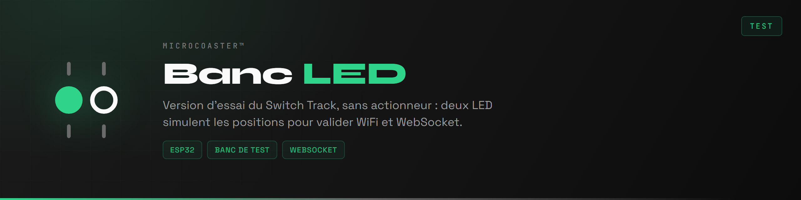
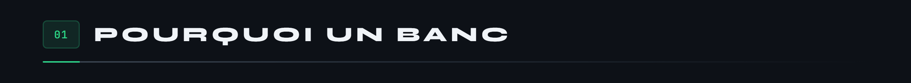
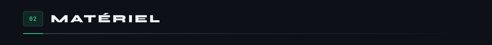
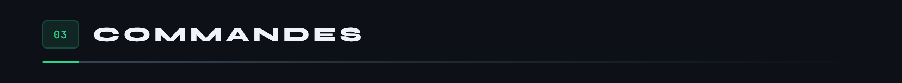
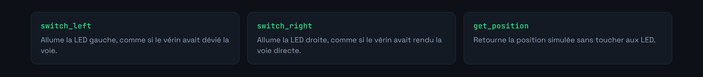
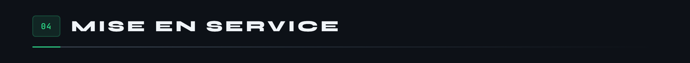
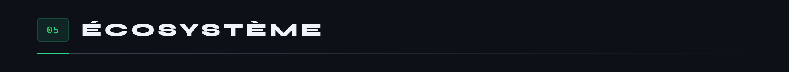

<div align="center">



</div>

Banc de test du module Switch Track, sans partie mécanique. Deux LED remplacent le vérin : l'une s'allume pour la position gauche, l'autre pour la droite. Tout le reste est identique au module réel, portail captif, authentification et liaison WebSocket comprises.

Il sert à valider la chaîne complète entre le serveur et un module avant de câbler un actionneur. Si les LED changent d'état au bon moment, le problème n'est pas dans le réseau.



Déboguer une liaison WebSocket avec un vérin branché, c'est cumuler deux sources de panne. Un ordre qui n'arrive pas et un vérin qui ne bouge pas produisent exactement le même symptôme.

Ce dépôt isole la moitié logicielle. On vérifie que l'authentification passe, que les commandes arrivent, que les réponses repartent, et que la reconnexion fonctionne après une coupure. Ensuite seulement on branche la mécanique.

Le code est celui du Switch Track amputé du pilotage moteur, soit environ soixante lignes de moins.




Une résistance de limitation par LED, rien d'autre. Un ESP32 DevKit et une plaque d'essai suffisent. Ce sont les mêmes broches que sur le module réel, où elles signalent la position pendant que le vérin travaille sur GPIO 21 et 22.



Les mêmes que le module réel, puisque c'est tout l'intérêt.





Nécessite [PlatformIO](https://platformio.org/) dans Visual Studio Code.


```bash
pio run                  # compilation
pio run -t upload        # téléversement du firmware
pio run -t uploadfs      # téléversement du portail vers LittleFS
pio device monitor       # console série, 115200 bauds
```

1. Alimenter le module. Il crée un point d'accès WiFi.
2. S'y connecter et ouvrir `http://192.168.4.1`.
3. Renseigner le réseau de destination.
4. Le module redémarre, rejoint le réseau et s'annonce auprès du serveur.

La console série à 115200 bauds trace chaque étape : connexion WiFi, ouverture du WebSocket, authentification, puis chaque commande reçue. C'est là qu'on lit ce qui ne va pas.




```ini
links2004/WebSockets        ; liaison avec le contrôleur
bblanchon/ArduinoJson       ; messages échangés
ayresnet/AyresWiFiManager   ; portail captif et reconnexion
```

Système de fichiers embarqué : **LittleFS**. Le module dont ce banc est la version d'essai est le [Switch Track](https://github.com/Microcoaster/Switch-Track), et le socle commun est le [WiFi Manager](https://github.com/Microcoaster/MicroCoaster_WifiManager).

---

<sub>MicroCoaster · Auteur : Cybertrist</sub>
